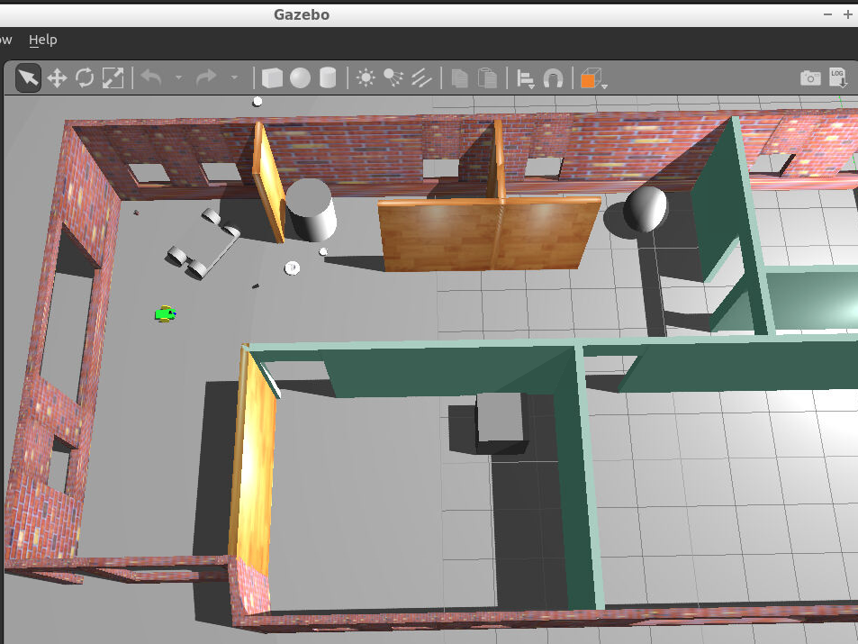

# Project 1. Build My World
Use Gazebo to simulate a robotic environment comprised of a building to house your future robot.

The image below is a screenshot of Gazebo showing part of the world created.

## To use
The folder `myrobot` and its content should be copied to your `catkin_ws/src` folder.

## Requirements
To run the code from this repository you will need to use [ROS Kinetic](http://wiki.ros.org/kinetic).
