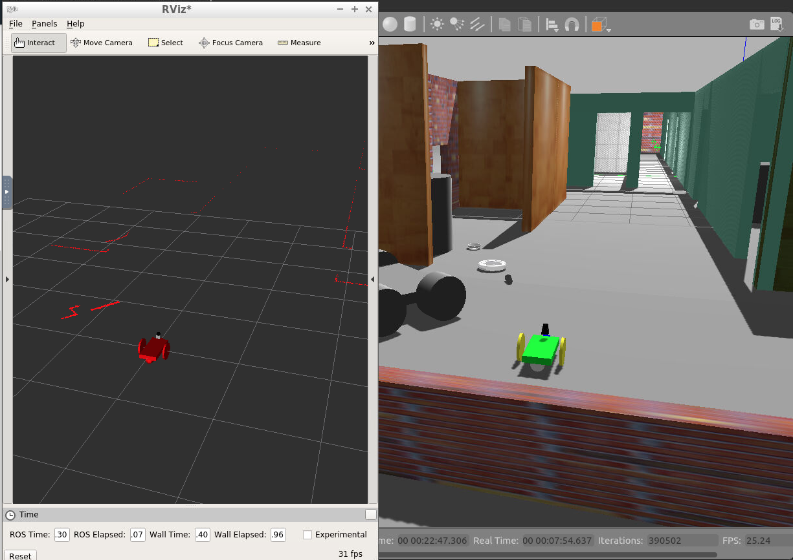

# Project 2. Go Chase It!
Use ROS, C++, and Gazebo to build and program a ball-chasing robot. It consists of designing a robot inside Gazebo, house it in a world you have to build, 
and code a C++ node in ROS to chase a white ball.

The screenshot below shows RViz (left) and Gazebo (right). The robot that was created can be seen in green in Gazebo and in red in RViz. RViz also shows the readings of the robot's laser scanner. 

## Requirements
To run the code from this repository you will need to use [ROS Kinetic](http://wiki.ros.org/kinetic).
