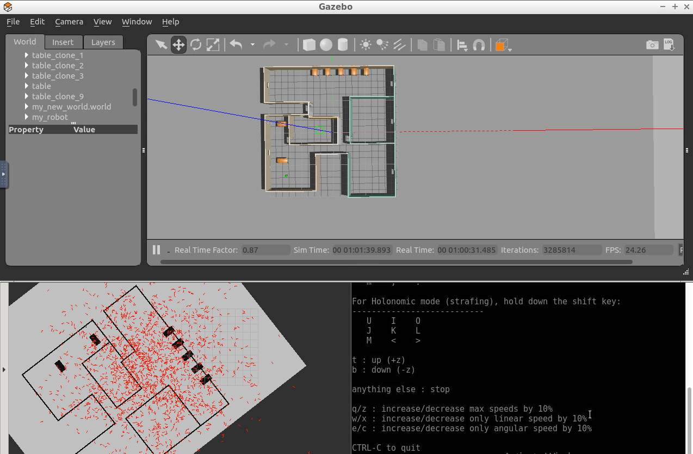
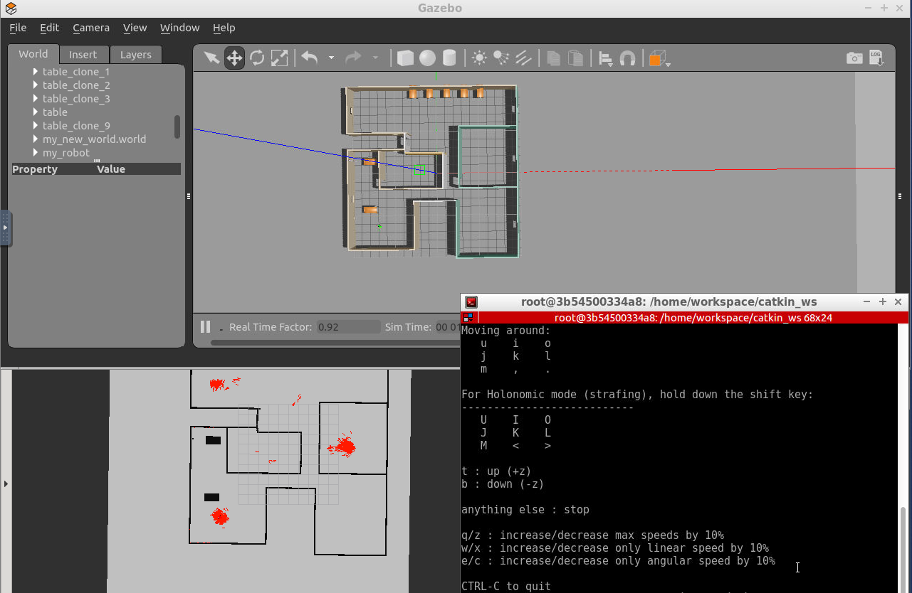

# Project 3. Where Am I?
Apply the Adaptive Monte Carlo Localization (AMCL) algorithm in ROS to estimate your robot’s position as it travels through a predefined set of waypoints. 

The screenshots below shows the AMCL in action. In the first screenshot, the robot was just teleported to a different position in the map. So, its initial pose was not known.



After moving the robot a bit, the particles start to converge around the best guesses for the robot location.




After moving around for a while, most particles are very close to the real robot pose:


## To use
The folders `my_robot` and `teleop_twist_keyboard` should be copied to your `catkin_ws/src` folder.

First, launch the simulation environment. Open a terminal and run:
```
$ cd /home/workspace/catkin_ws/
$ source devel/setup.bash
$ roslaunch my_robot world_with_robot.launch
```

In a new terminal, launch the amcl launch file:
```
$ cd /home/workspace/catkin_ws/
$ source devel/setup.bash
$ roslaunch my_robot amcl.launch
```

In a third terminal, run the teleop node to move the robot around:
```
$ cd /home/workspace/catkin_ws/
$ source devel/setup.bash
$ rosrun teleop_twist_keyboard teleop_twist_keyboard.py 
```

In RViz, load the configuration file `rviz_config_project3.rviz` located at `.../my_robot/config`.

Select the teleop terminal and use the keyboard to move the robot around. You should see the red arrows converging around the robot pose. 

## Requirements
To run the code from this repository you will need to use [ROS Kinetic](http://wiki.ros.org/kinetic).
