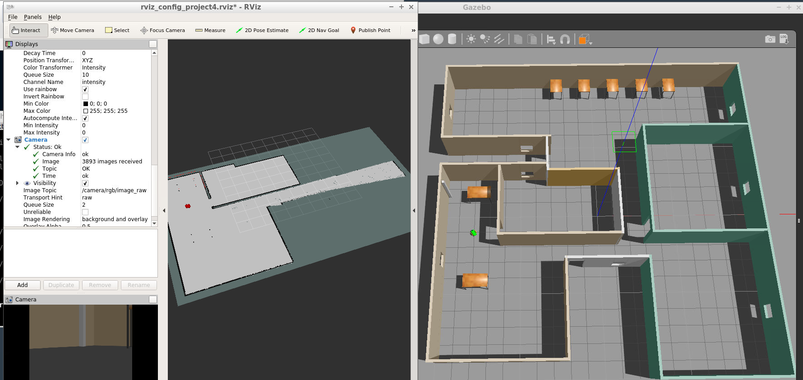
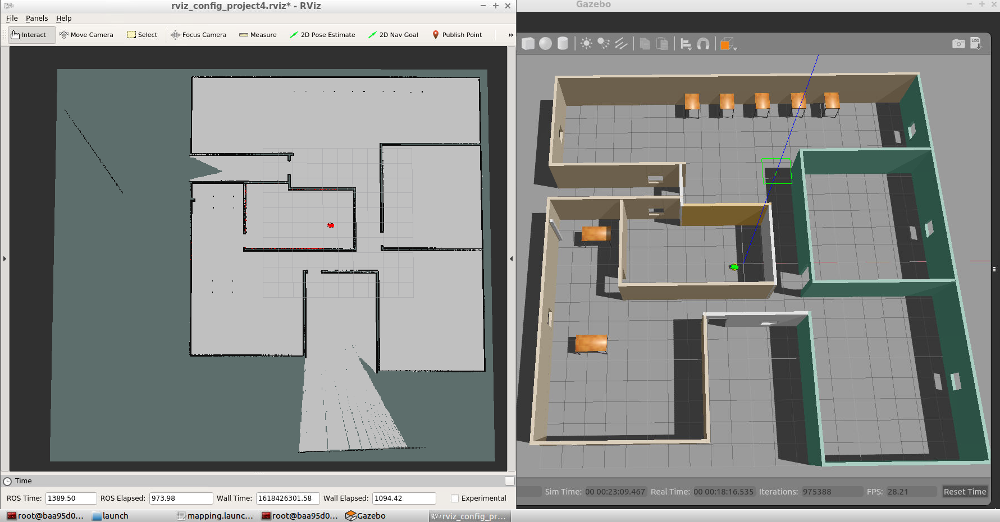
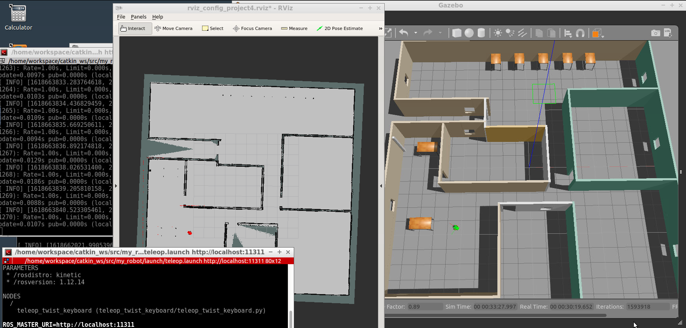

# Project 4. Map My World
Interface your robot with an RTAB Map ROS package to localize it and build 2D and 3D maps of their environment. 

## Generated db files
The generated db files can be downloaded [from here](https://drive.google.com/drive/folders/13x1oxjpjZQpvl7NnLVNQHOJxgDwQUb9A?usp=sharing).

## Mapping process
The following screenshots show the mapping process and the final result. In the first three screens, RViz and Gazebo are shown side-by-side during the mapping process, while the robot is driven via teleop node.







## RTAB-MAP Viewer
The resulting map is shown below. There were 25 loop closures. 


## To use
To map the environment, first, launch the Gazebo world and RViz, spawn the robot in the environment. Open a terminal and run:

```
$ cd /home/workspace/catkin_ws/
$ source devel/setup.bash
$ roslaunch my_robot world_with_robot.launch
```

In a new terminal, run the teleop node to move the robot around:
```
$ cd /home/workspace/catkin_ws/
$ source devel/setup.bash
$ roslaunch my_robot teleop.launch
```

In a third terminal, launch the mapping.launch file to run the RTAB-Map SLAM:
```
$ cd /home/workspace/catkin_ws/
$ source devel/setup.bash
$ roslaunch my_robot mapping.launch
```

Now, select the teleop terminal and use the keys to navigate the robot to create a map of the whole environment. After terminating the node, find the map db file in the /root/.ros/ folder.

The generated db files are in the folder '/catkin_ws/src/my_robot/db_files'.

Optionally, for localization run the following launch file (instead of the mapping one):
```
$ cd /home/workspace/catkin_ws/
$ source devel/setup.bash
$ roslaunch my_robot localization.launch
```

## Requirements
To run the code from this repository you will need to use [ROS Kinetic](http://wiki.ros.org/kinetic).
