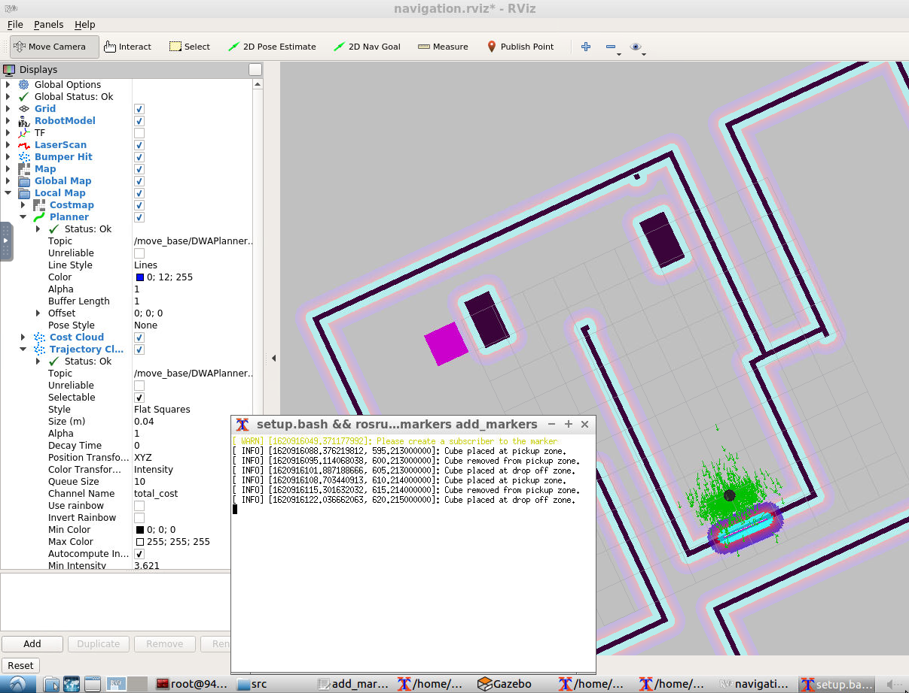
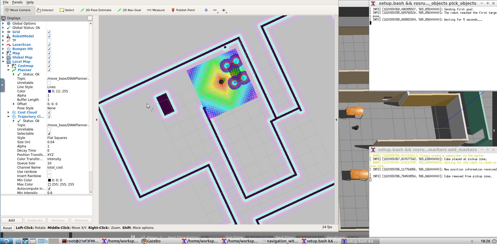

# Project 5. Home Service Robot
Combine everything you’ve learned in this program to simulate a home service robot that can map, localize, and navigate to transport objects, moving from one room to another autonomously. 

## Requirements and Packages
To run the code from this repository you will need to use [ROS Kinetic](http://wiki.ros.org/kinetic).

You also need to install the following ROS packages in your `catkin_ws/src` directory:

- [**slam_gmapping**](https://github.com/ros-perception/slam_gmapping): performs SLAM and builds a map of the environment with a robot equipped with laser range finder sensors or RGB-D cameras.
- [**turtlebot**](https://github.com/turtlebot/turtlebot): we will use `turtlebot_teleop` to manually control a robot using keyboard commands during testing.
- [**turtlebot_interactions**](https://github.com/turtlebot/turtlebot_interactions): we will use `turtlebot_rviz_launchers` to load a preconfigured Rviz workspace that automatically loads the robot model, trajectories, and map.
- [**turtlebot_simulator**](https://github.com/turtlebot/turtlebot_simulator): we will use `turtlebot_gazebo` to deploy a Turtlebot in a Gazebo environment.

To do that, clone the corresponding GitHub repositories, install their dependencies and run a `catkin_make`:
```
$ cd ~/catkin_ws/src
$ git clone https://github.com/ros-perception/slam_gmapping
$ git clone https://github.com/turtlebot/turtlebot
$ git clone https://github.com/turtlebot/turtlebot_interactions
$ git clone https://github.com/turtlebot/turtlebot_simulator
$ cd ~/catkin_ws/
$ source devel/setup.bash
$ rosdep -i install gmapping
$ rosdep -i install turtlebot_teleop
$ rosdep -i install turtlebot_rviz_launchers
$ rosdep -i install turtlebot_gazebo
$ catkin_make
$ source devel/setup.bash
```

## How to Use
Some scripts were prepared to facilitate loading the necessary launch files to run the simulation. 

### Running in the Udacity Workspace
Due to an issue with a missing library, everytime I opened the Udacity Workspace I had to install the `rospkg` library before running the other scripts. To automate that, I created a simple script. To run it, navigate to the `catkin_ws` directory and run the `init_ws.sh` script:
```
$ cd /home/workspace/catkin_ws
$ ./init_ws.sh
```
This will install `rospkg` that seems to be missing in the workspace. Note that this procedure is only necessary if you are using the provided Udacity Workspace for the Home Service Robot. 

### SLAM testing
To manually test SLAM, run the script `test_slam.sh`. It will open separate terminals and run the launch files to open Gazebo, load the environment with a Turtlebot in it, create the interface with the SLAM package, open RViz to visualize the mapping process and run the teleop node so you can control the robot manually.
```
$ cd ~/catkin_ws/src/scripts
$ ./test_slam.sh
```
After performing mapping, save the map by openning a new terminal and running:
```
$ cd ~/catkin_ws
$ source devel/setup.bash
$ rosrun map_server map_saver map.yaml
```
The image below shows a screenshot of the execution of the `test_slam.sh` script using the map created in the previous project. In the left Gazebo shows the environment with Turtlebot entering the corridor. In the right side RViz shows the location of the robot in the map. In the center you see the terminal running the teleop node that is controlling the robot. 


### Navigation testing
To test navigation, run the script `test_navigation.sh`. It will call the launch files to open Gazebo, load the environment with a Turtlebot in it, run the AMCL to localize the robot and open RViz with a visualization of the map. On RViz, click the button `2D Nav Goal` and select a pose in the map. You will see the path planned and the robot should move to the goal.
```
$ cd ~/catkin_ws/src/scripts
$ ./test_navigation.sh
```
The image below shows a screenshot of the execution of the `test_navigation.sh` script when the robot is first localized by the AMCL (see the particles around your robot).  


The image below shows a screenshot of the execution of the `test_navigation.sh` script when the robot is following the plan to go to the goal pose. The green line on RViz screen is the path to be followed by the robot. 


### Reaching Multiple Goals
The script `pick_objects.sh` runs the launch files to open Gazebo with Turtlebot, the AMCL, RViz with a visualization of the map and the node `pick_objects`, which sends two different targets for the robot to reach in sequence. Run the script to see the robot moving autonomously to the two specified target poses: 
```
$ cd ~/catkin_ws/src/scripts
$ ./pick_objects.sh
```
The image below shows a screenshot of the execution of the `pick_objects.sh` script when the robot is at the first target and it already received the plan to move to the second target. The messages on the terminal screen show the sequence of events.  


The next screenshot shows the robot after it gets to the second target.


### Virtual Objects
The script `add_markers.sh` runs the launch files to open Gazebo with Turtlebot, the AMCL, RViz with a visualization of the map and the node `add_markers`, which adds a visualization of a cube at the pickup and the drop off positions in RViz. Run the script to see the cubes changing from the pickup to the drop off positions: 
```
$ cd ~/catkin_ws/src/scripts
$ ./add_markers.sh
```
The image below shows a screenshot of the execution of the `add_markers.sh`. The first image shows the block at pickup position, and the second shows the block at dropoff position.  




### Home Service Robot
Putting it all together, the **home service robot** will automatically execute a task of picking a virtual object in a pre-specified position and transport it to another pre-specified position. The script `home_service.sh` runs the launch files to open Gazebo with Turtlebot, the AMCL, RViz with a visualization of the map, the node `add_markers` (responsible for adding and removing the virtual objects) and the node pick_objects to send the goal positions. 
```
$ cd ~/catkin_ws/src/scripts
$ ./home_service.sh
```
The screenshots below illustrate the execution of the Home Service Robot. In the first screen the robot is moving towards the object, to pick it up./ In the second screen, the robot is transporting the object to the drop off position. In the third screen, the robot is at the drop off position and the virtual object has been already placed there. 





