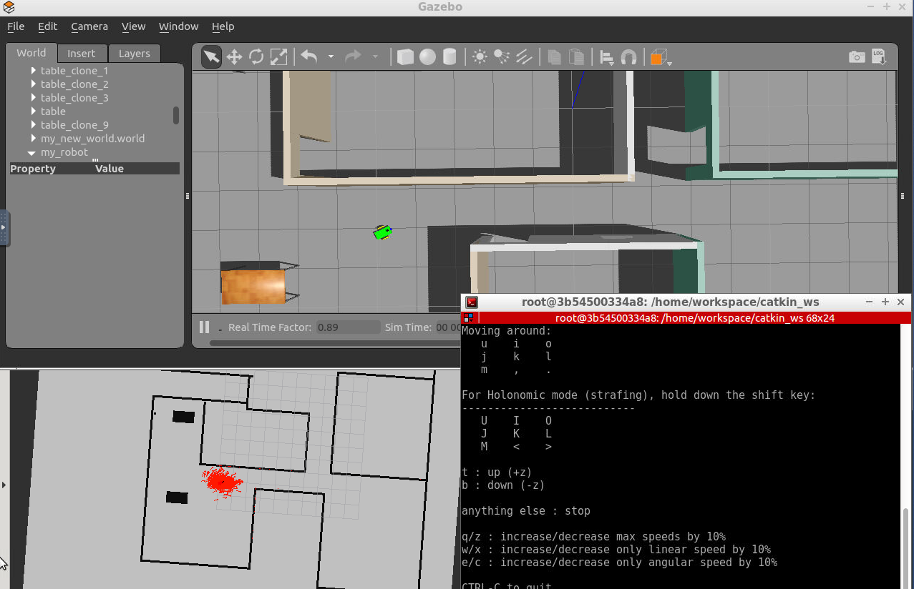

# ROS projects: Udacity - Robotics Software Engineer nanodegree
Projects from Udacity's [Robotics Software Engineer nanodegree](https://www.udacity.com/course/robotics-software-engineer--nd209).

This program is a collection of courses and practical projects to programming robots using the ROS framework and C++ to build and apply algorithms for localization, mapping, and navigation in the context of mobile robots. 

This reporsitory contains the files and code I am preparing to fulfill the requirements of the projects.

## Projects
The Robotics Software Engineer nanodegree is organized in 6 courses and 5 projects. The projects are briefly explained below (as of March 2021).

### [Project 1. Build My World](/Project_1)
Use Gazebo to simulate a robotic environment comprised of a building to house your future robot. 

### [Project 2. Go Chase It!](/Project_2)
Use ROS, C++, and Gazebo to build and program a ball-chasing robot. It consists of designing a robot inside Gazebo, house it in a world you have to build, 
and code a C++ node in ROS to chase a white ball.

### [Project 3. Where Am I?](/Project_3)
Apply the Adaptive Monte Carlo Localization algorithm in ROS to estimate your robot’s position as it travels through a predefined set of waypoints. 

### [Project 4. Map My World](/Project_4)
Interface your robot with an RTAB Map ROS package to localize it and build 2D and 3D maps of their environment. 

### [Project 5. Home Service Robot](/Project_5)
Combine everything you’ve learned in this program to simulate a home service robot that can map, localize, and navigate to transport objects, moving from one room to another autonomously. 

## Requirements
To run the code from this repository you will need to use [ROS Kinetic](http://wiki.ros.org/kinetic).
